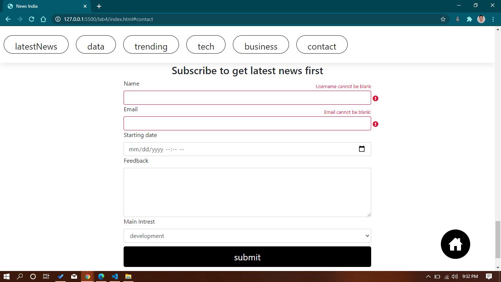
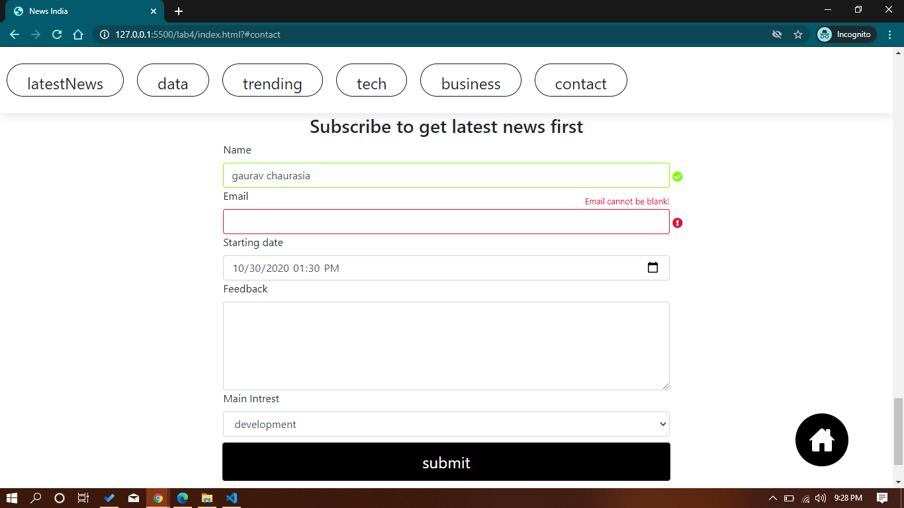
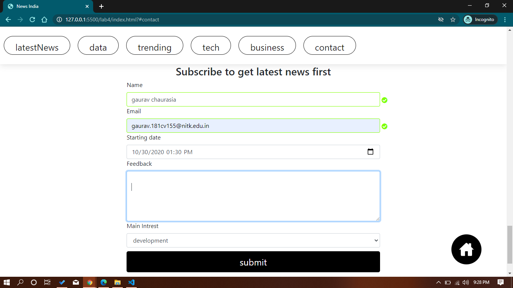

# Some screen shots of the html layout

` when both email and name are blank or invalid`



` username valid but email is blank`



` email is not blank but not a valid email address`
```js
    function isEmail(email) {
        return /^(([^<>()\[\]\\.,;:\s@"]+(\.[^<>()\[\]\\.,;:\s@"]+)*)|(".+"))@((\[[0-9]{1,3}\.[0-9]{1,3}\.[0-9]{1,3}\.[0-9]{1,3}])|(([a-zA-Z\-0-9]+\.)+[a-zA-Z]{2,}))$/.test(email);
    }
```


` all fields are valid`


